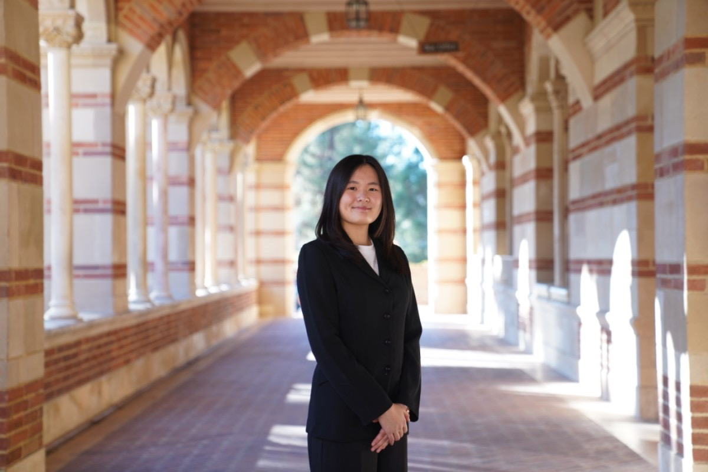

::: {.hero-section}

::: {.hero-text}

Victoria Vivian Chan

# Statistics, data science, and quantitative analysis for real-world problems.

UCLA Statistics &amp; Data Science student building analytical, research-driven, and data-focused work across machine learning, statistical modeling, and data storytelling.

I am interested in applying statistical and computational methods to understand complex datasets and support data-driven decision making. My work ranges from statistical learning and experimental design to digital humanities and applied analytics, with growing interests in quantitative finance, risk, and strategy.

<a href="projects.qmd" class="btn-primary-custom"><i class="bi bi-grid"></i> Explore Projects</a>
<a href="resume.pdf" class="btn-secondary-custom" target="_blank"><i class="bi bi-file-earmark-person"></i> View Resume</a>

:::

::: {.hero-photo-wrap}
{.hero-photo}
:::

:::

::: {.feature-strip}

::: {.feature-mini-card}
### <i class="bi bi-briefcase"></i> Current Focus
Data science, analytical research, and practical applications of statistics across academic and professional work.
:::

::: {.feature-mini-card}
### <i class="bi bi-bar-chart-line"></i> Strengths
Statistical modeling, machine learning, experimentation, and translating technical analysis into clear insights.
:::

::: {.feature-mini-card}
### <i class="bi bi-mortarboard"></i> Career Interests
Data science, quantitative finance, analytics, and strategy-oriented roles that value rigorous and thoughtful problem solving.
:::

:::

::: {.section-card}
## Welcome

I am a UCLA Statistics and Data Science student interested in statistical modeling, machine learning, data analysis, and research communication. I enjoy building work that combines technical rigor with clarity, whether that means developing predictive models, designing experiments, or presenting insights through polished reports and public-facing websites.

Across coursework, internships, and independent projects, I have worked on problems involving classification, inference, visualization, and applied analytics. I am especially interested in opportunities where strong analytical methods can support better decision making.
:::